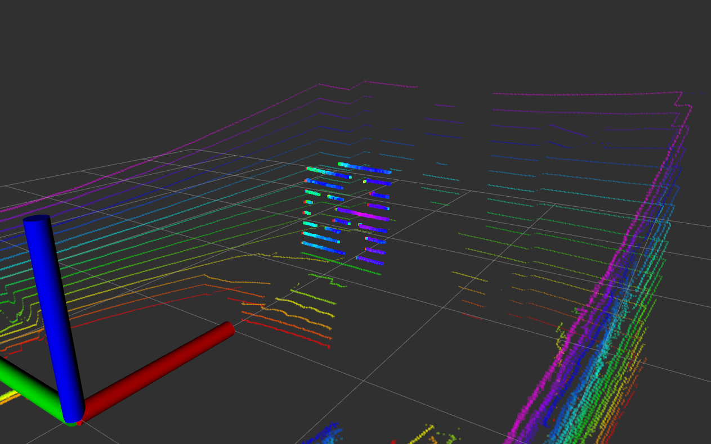

## How to use passthrough_config 

The purpose of this node is to find good parameters for passthrough filter, which exactly extract the calibration board cloud.

If the position of the calibration board changes, you need to manually modify parameters and save them.
```
	# For simulator
    roslaunch lidar_camera_calibration passthrough_config.launch
	# For real LiDAR
	roslaunch lidar_camera_calibration real_passthrough_config.launch
```

Then open a new terminator.
```
    source devel/setup.bash
```

Adjust the posture of the cloud
```
    # Unit is degree. Oder: x y z
    rosservice call /passthrough_config/modify_rpy -- 0.0 0.0 10.0
```

Modify the numerical limits for the field for filtering cloud.
```
    # Field limits: min max. The unit is meter.
    rosservice call /passthrough_config/modify_field_x -- -5.0 5.0
    rosservice call /passthrough_config/modify_field_y -- -5.0 5.0
    rosservice call /passthrough_config/modify_field_z -- -5.0 5.0
```

Save parameters to a yaml file
```
    # By default, save to ~/config
    rosservice call /passthrough_config/save
    # Reset parameters
    rosservice call /passthrough_config/rest
    # show current values of parameters
    rosservice call /passthrough_config/show
    # load existed parameters 
    rosservice call /passthrough_config/load config.yaml
```